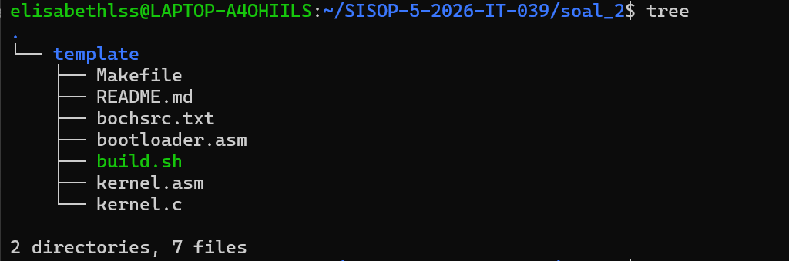
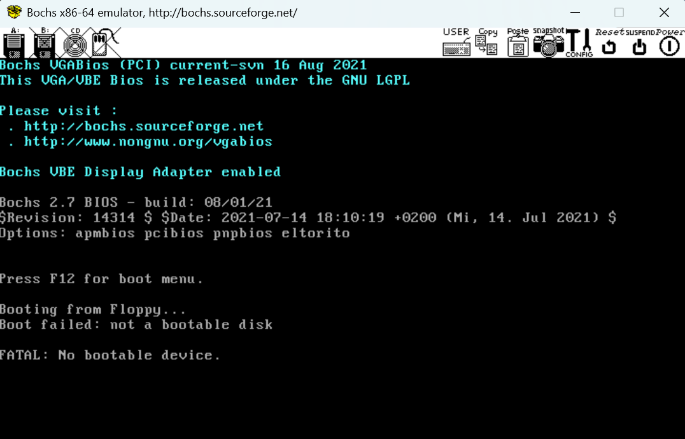
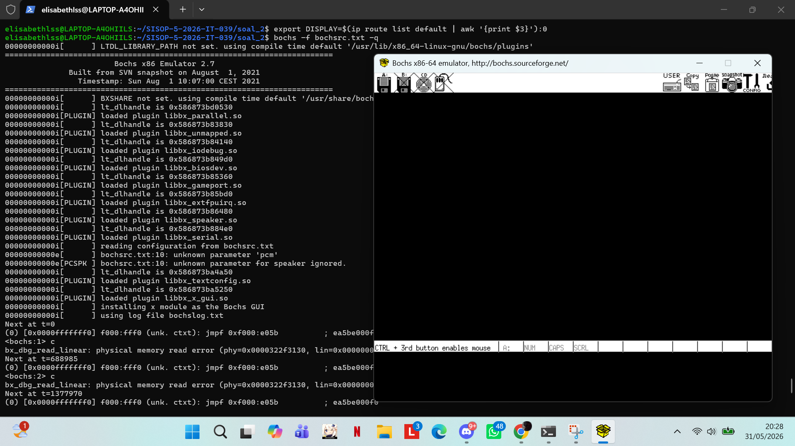
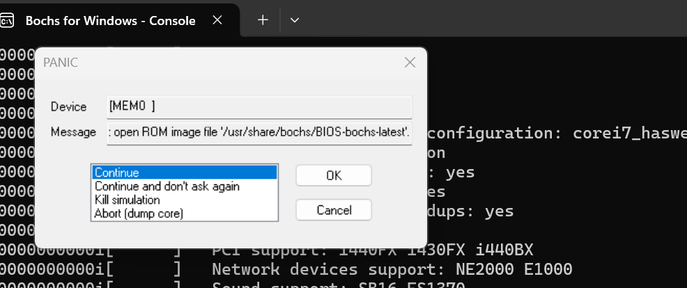

# SISOP-5-2026-IT-039
## Laporan Resmi Modul 5 Sisop oleh Elisabeth L. S. S. | 039
note: belum bisa solve maaf ya mas bochsnya ngeblank terus..

### Soal 2
### Penjelasan
Pada soal 2, kita diminta melengkapkan file `kernel.asm` dan `kernel.c` untuk membuka Last Gift dari Asisten di Bochs Emulator. Beberapa steps yang diminta adalah:  
a. Mendownload file `template.zip` untuk mendapatkan file-file yang dibutuhkan  
b. Melengkapkan fungsi `_getChar` di file `kernel.asm`  
c. Melengkapi file `kernel.c`, sehingga berhasil membuat instruksi **check**  
d. Melengkapi file `kernel.c`, sehingga berhasil menjalankan fitur **add**  
e. Melengkapi file `kernel.c`, sehingga berhasil menjalankan fitur **sub**  
f. Melengkapi file `kernel.c`, sehingga berhasil menjalankan fitur **fac**  
g. Melengkapi file `kernel.c`, sehingga berhasil menjalankan fitur **season**  
h. Melengkapi file `kernel.c`, sehingga berhasil menjalankan fitur **triangle**  
i. Melengkapi file `kernel.c`, sehingga berhasil menjalankan fitur **clear** dan **help**

#### a. Mendownload file `template.zip` untuk mendapatkan file-file yang dibutuhkan
```
gdown "https://drive.google.com/file/d/14rOog6VbT6sxjp3s_GJoTW7hgE6FAtmo/view?usp=sharing"
unzip template zip
```
Hasil:  


#### b. Melengkapkan fungsi `_getChar` di file `kernel.asm`
```
_getChar:
	mov ah, 0x00
	int 0x16
	mov ah, 0x00
	ret
```
: Mengisi register `ah` dengan nilai **0x00**. Nilai **0x00** ini adalah sandi atau perintah untuk BIOS agar program berhenti sementara dan menunggu user memberi input lagi ke program.  
: `int` untuk *interrupt*, `0x16` adalah sandi khusus BIOS untuk mengurus Keyboard Services.  
: Setelah tombol ditekan, register `ah` sekarang berisi scan code (sisa data dari BIOS tadi). Dalam aturan compiler C 16-bit, *return value* sebuah fungsi selalu dibaca dari register gabungan `ax` (yang terdiri dari ah dan al).  
: `ret` untuk *return*, mengakhiri fungsi Assembly dan mengembalikan kendali ke program C yang memanggilnya.

#### c. Melengkapi file `kernel.c`, sehingga berhasil membuat instruksi **check**  
```
if (strcmp(cmd, "check") == 0) {
            printString("ok");
```
: `strcmp` untuk mengecek huruf per huruf. Jika input yang diketik user sama persis dengan `check`, maka sistem mengembalikan nilai 0 dan jika benar hasilnya 0, OS akan mencetak string "ok" ke layar.

#### d. Melengkapi file `kernel.c`, sehingga berhasil menjalankan fitur **add**
```
} else if (startsWith(cmd, "add ")) {
            int i = 4, a, b;
            char resStr[16];
            a = atoi(cmd + i);
            if (cmd[i] == '-') i++;
            while (cmd[i] >= '0' && cmd[i] <= '9') i++;
            while (cmd[i] == ' ') i++;
            b = atoi(cmd + i);
            intToString(a + b, resStr);
            printString(resStr);
```
: Logika di dalamnya melakukan parsing string. Angka pertama diambil dengan fungsi atoi (untuk mengubah *string* menjadi *integer*.  
: Kode melakukan perulangan while untuk "melompati" karakter angka dan spasi agar bisa menemukan posisi angka kedua.  
: Setelah angka kedua didapat, program menjumlahkannya (a + b). Hasilnya harus diubah kembali menjadi huruf *string* menggunakan `intToString` sebelum dicetak dengan `printString`.

#### e. Melengkapi file `kernel.c`, sehingga berhasil menjalankan fitur **sub** 
```
} else if (startsWith(cmd, "sub ")) {
            // (logika parsing seperti add)
            b = atoi(cmd + i);
            intToString(a - b, resStr);
            printString(resStr);
```
: Logikanya sama dengan `add`, tapi dengan mengeksekusi operasi matematika pengurangan (a - b) lalu mencetak hasilnya.

#### f. Melengkapi file `kernel.c`, sehingga berhasil menjalankan fitur **fac** 
```
} else if (startsWith(cmd, "fac ")) {
            int n = atoi(cmd + 4);
            char resStr[16];
            
            if (n < 0 || n > 7) {
                printString("know your limit little bro.");
            } else {
                intToString(factorial(n), resStr);
                printString(resStr);
            }
```
: Mengambil satu angka setelah kata `fac`. Karena OS ini menggunakan arsitektur 16-bit, tipe data int maksimal hanya bisa menampung angka 32,767. Mulai 8!, OS sudah tidak bisa menampung angkanya dan akan menyebabkan *integer overflow*. Logika `if (n < 0 || n > 7)` digunakan untuk mencegah angka di atas 7 dan mencetak pesan "know your limit little bro.".

#### g. Melengkapi file `kernel.c`, sehingga berhasil menjalankan fitur **season**  
```
} else if (startsWith(cmd, "season ")) {
            char* name = cmd + 7;
            if (strcmp(name, "winter") == 0) {
                color = 0x0F; isRadiant = 0;
            // ... (spring, summer, fall)
            } else if (strcmp(name, "radiant") == 0) {
                isRadiant = 1;
            // ...
```
: Sistem akan mengekstrak nama musim dari input.  
: Sistem mengganti nilai variabel global color sesuai dengan kode palet warna VGA.  
: Jika memilih *radiant*, variabel `isRadiant` diubah menjadi 1. Variabel ini dibaca oleh fungsi `printChar()` untuk membuat warnanya berubah-ubah pada setiap huruf yang dicetak.

#### h. Melengkapi file `kernel.c`, sehingga berhasil menjalankan fitur **triangle** 
```
void printTriangle(int n) {
    int i, j;
    for (i = 1; i <= n; i++) {
        for (j = 0; j < i; j++) {
            printChar('*');
        }
        newline();
    }
}
// dalam fungsi main():
        } else if (startsWith(cmd, "triangle ")) {
            int n = atoi(cmd + 9);
            printTriangle(n);
            continue;
```
: Pada fungsi main(), tinggi segitiga diambil dari angka yang diinput user. Perintah `continue` dipanggil agar OS tidak mencetak `newline()` ganda di akhir.  
: Fungsi `printTriangle` menggunakan `nested loop`. **(i)** mengatur jumlah baris ke bawah, sedangkan **(j)** mengatur jumlah karakter yang dicetak ke samping pada baris tersebut.

#### i. Melengkapi file `kernel.c`, sehingga berhasil menjalankan fitur **clear** dan **help**
```
} else if (strcmp(cmd, "clear") == 0) {
            clearScreen();
            continue;
// ...
        } else if (strcmp(cmd, "help") == 0) {
            printString("check add sub fac season triangle clear about");
```
: `clear` untuk memanggil fungsi `clearScreen()`, yang bekerja dengan menulis karakter spasi kosong (' ') dengan warna latar hitam ke seluruh 4000 byte memori video VGA (0xB800), lalu mengembalikan kursor kembali ke ujung kiri atas (0).  
: `help` berfungsi untuk mencetak satu baris teks yang berisi daftar command yang tersedia.

#### Compile & Run
Kalau pakai Bochs dari WSL,
```
make
export DISPLAY=$(ip route | awk '/default/ {print $3}'):0
bochs -f bochsrc.txt -q
```

Kalau pakai Bochs dari Windows,
1. Buka Bochs App
2. ```
   make
   ```
3. Load file `bochsrc.txt`, dan Start.
   
### Kendala
1. Screen Bochs Emulator muncul saat di-*run*, tetapi terus-menerus blank screen dan string intro nya tidak keluar.
2. Screen Bochs mengatakan *"No bootable devices"* (Saat pakai Bochs dari WSL)
3. Screen Bochs error PANIC mengatakan *"can't open file image"*

Dokum:  





